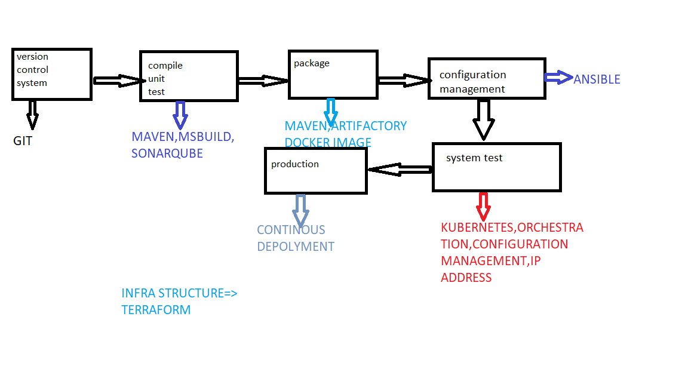
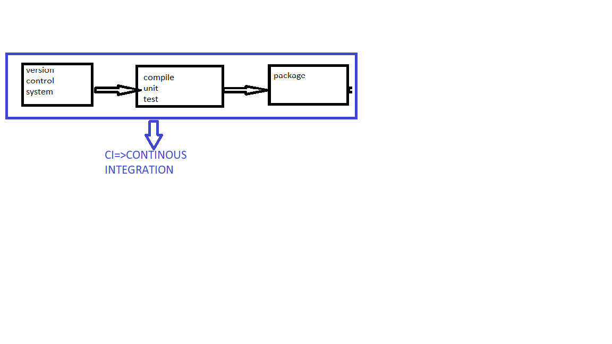
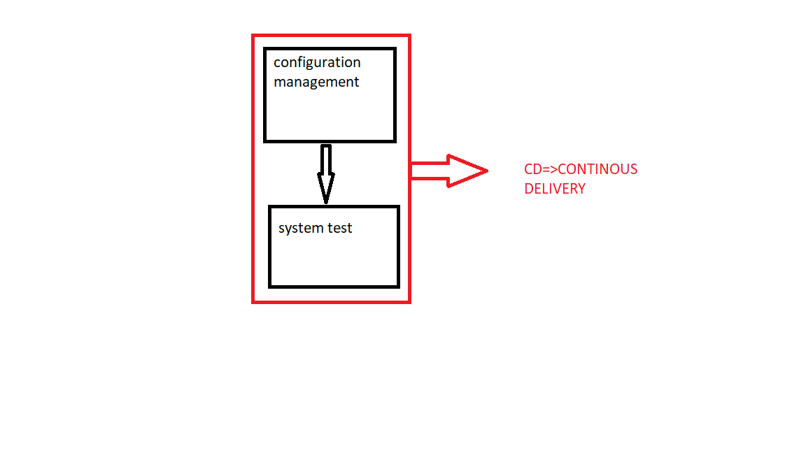
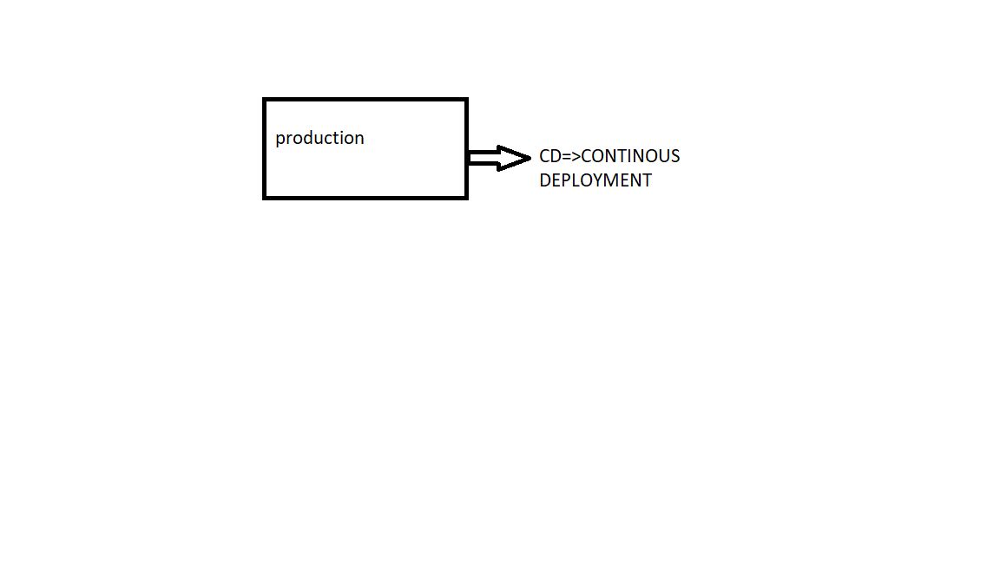

### introduction for jenkins
#### workflow 

 ```
 git add .
 git status
 git commit -m "first"
 git log
 git remote add origin https://github.com/venu0245/Jenkins.git
 git push -u origin master
 
 ```





* version control system=>git
* compile unit test=>maven,msbuild,sonarqube
* package=>maven,artifactory,docker image
* configure management=>ansible,chef
* system test=>ip address,kubernetes,orchestration,configuration management tools
* production=>deployment

 

hello
